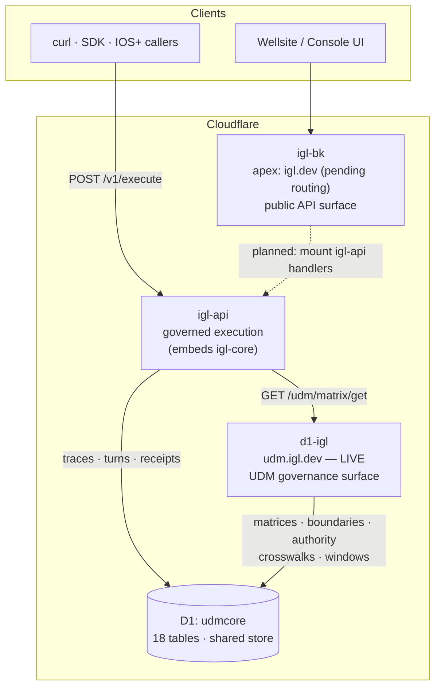
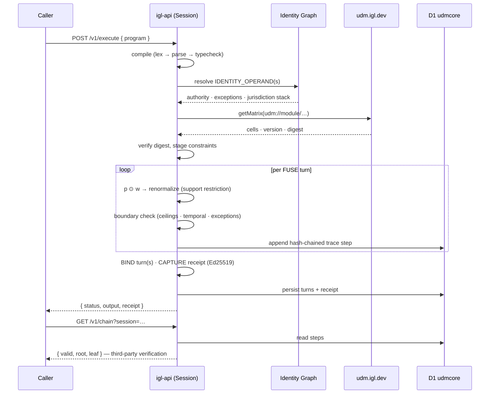
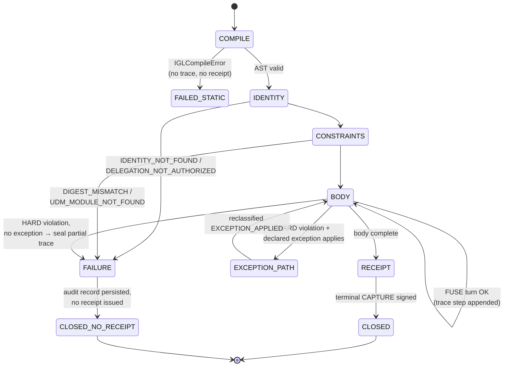
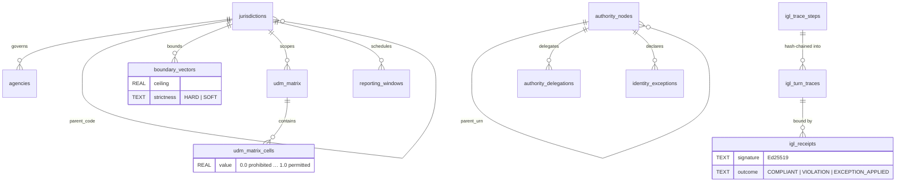
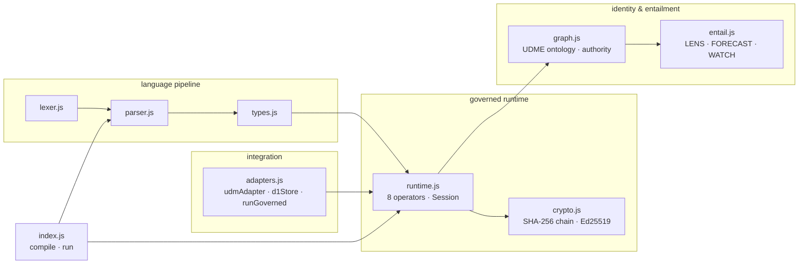

# IGL Platform — Architecture

> **Status & lineage (v0.2 reconciliation).** This document is the v1.0
> platform architecture. §1–§4 remain the **target topology** — `igl-bk` and
> `d1-igl` exist on the account, `udmcore` is provisioned, and the ERD is the
> intended governance store. §5 and §6 are **superseded by the v0.2 reference
> implementation** in `src/`, specified in [`docs/SPEC.md`](./docs/SPEC.md);
> they are retained below, annotated, because the deltas are decisions, not
> drift. Concept map, v1.0 → v0.2:
>
> | v1.0 (this doc) | v0.2 (built) | Where |
> |---|---|---|
> | `graph.js` — UDME ontology · authority | `graph.js` — two-layer fold; authority moves **only** on signed grants; observation never promotes | `docs/GRAPH.md` |
> | `crypto.js` — SHA-256 chain · Ed25519 | `store.js` (hash-chained journal, `digest_i = sha256(digest_{i−1} ‖ canonical(entry))`) + `sign.js` (Ed25519 trace and head receipts; keyed `IOS.Attest`) | `src/store.js`, `src/sign.js` |
> | `types.js` · `entail.js` · `adapters.js` | `check.js` (static semantics) · `builtins.js` (governed surface) · runtime seams (`D1Journal`, `AIRuntime.invoke`) | `docs/SPEC.md` §7 |
> | §2 `p ⊙ w → renormalize` (distribution fusion) | `bridge.js` — prefix automaton (γ) + projection onto the admissible set (α), soundness `α(γ(S)) ⊆ ↓S ∪ {ABSTAIN}`. Support restriction is enforced *structurally* rather than by renormalising mass | `docs/BRIDGE.md` |
> | §4 `udm_matrix_cells REAL 0.0–1.0` | Not built. v0.2 boundaries are set/lattice-valued, not graded — a graded matrix layers on later without changing the containment tests | — |
> | §6 receipt bound to matrix digest | per-envelope `schemaDigest`/`scopeDigest` (SHA-256, canonical JSON) + journal chain head | `src/bridge.js`, `src/store.js` |
> | §6 smoke test `valid: false, brokenAt: <step>` | `journal.verify()` → `{ ok: false, at: <seq>, reason }` — the property is real; the field is **`at`** | `test/store.test.js` |

All diagrams are Mermaid and render natively on GitHub. Companion documents:
[point-of-inflection.md](./point-of-inflection.md) (canonical fusion math and
halt semantics) and [../DEPLOY.md](../DEPLOY.md) (deploy runbook).

## 1. Deployment topology

## 2. Governed execution — one session

## 3. Session lifecycle

## 4. udmcore data model

## 5. igl-core module graph — *superseded; see the status table above*

The graph below is the v1.0 plan. The shipped module graph is:
`lexer → parser → check → interpreter`, with `builtins` (governed call surface
+ intent registry), `runtime` (UDM/AI/IOS), `graph` (identity fold), `bridge`
(UDM↔AI translation), and `store` (hash-chained journal: Memory/File/D1).

## 6. Trust chain

```mermaid
flowchart LR
    Z["session_id"] -->|"SHA-256(GENESIS:id)"| H0["hash₀"]
    H0 --> S1["step₁ record"] -->|"SHA-256(hash₀ ‖ record)"| H1["hash₁"]
    H1 --> S2["step₂ record"] --> H2["hash₂ …"]
    H2 --> TT["turn traces<br/>(sequence + parent links)"]
    TT --> RC["GOVERNANCE_RECEIPT<br/>identity · matrix digest · root/leaf"]
    RC -->|"Ed25519 sign"| SIG["signature"]
    SIG --> V["/v1/chain + VERIFY<br/>third-party recomputation"]
    style RC fill:#e7f6f0,stroke:#0e8f62
```

Tampering with any step record changes its recomputed hash, which breaks every
subsequent link. In v0.2 this is `journal.verify()` returning
`{ ok: false, at: <seq>, reason: "body does not reproduce its digest" }` —
demonstrated in `test/store.test.js` by doctoring a persisted `TX-RRC` grant to
`US` and by deleting a mid-chain record — in both cases the journal now refuses
to load. The `RC → SIG` edge above is built: `src/sign.js` signs trace digests
and verified chain heads with Ed25519, a keyed `IOS.Attest` embeds the receipt
in the trace before the chain covers it, and `Signer.verifyHeadReceipt` /
`verifyTraceReceipt` are the third-party recomputation this diagram promises.
